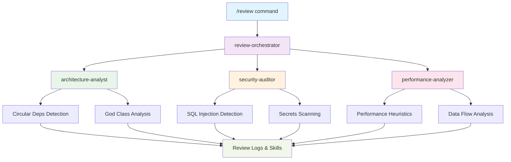
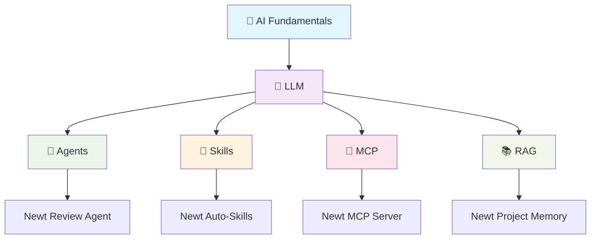

<div align="center">

# 🦎 Newt

[](https://opensource.org/licenses/MIT)
[](https://github.com/your-repo/newt)
[](https://claude.ai)
[](https://modelcontextprotocol.io)

> **AI-Powered Development Assistant** for architecture, security, performance, and quality automation  
> *"Game over, man! Game over!"* - Don't let bugs be the Xenomorphs of your codebase. Newt's got your back, just like LV-426's finest.

---

</div>

## 🌟 Overview

`Newt` is a comprehensive AI development assistant plugin that transforms how you review, plan, and improve code. Built for **Claude Code**, **Windsurf**, and **Cursor**, it provides intelligent automation across your entire development lifecycle.

Named after the plucky survivor from LV-426, Newt is your reliable companion in the hostile environment of software development - because sometimes the only way to survive is with a smart AI watching your six.

### ✨ Key Capabilities

<div align="center">

| 🔍 **Code Review Automation** | 🚀 **PR Review Intelligence** | 💡 **Structured Brainstorming** | ⚡ **Continuous Quality** |
|------------------------------|------------------------------|----------------------------------|--------------------------|
| Architecture analysis | Commit planning | Ideation sessions | Real-time suggestions |
| Security audits | PR splitting | Decision artifacts | Automated skills |
| Performance insights | Review-ready summaries | ADR generation | Quality monitoring |
| **Xenomorph detection** | **Dropship deployment** | **Hudson's optimism** | **LV-627 survival** |
| Bug hunting in the vents | Smooth CI/CD pipelines | Mostly positive vibes | Code that survives production |

</div>

---

## � Table of Contents

| 📖 **Section** | 🎯 **Purpose** | 🔗 **Quick Link** |
|----------------|----------------|------------------|
| **Quick Start** | Get up and running in minutes | [⚡ Quick Start](#-quick-start) |
| **Available Commands** | All Newt commands and usage | [📋 Available Commands](#-available-commands) |
| **Agents & Skills** | AI agents and their capabilities | [🤖 Agents](#-agents) • [🛠️ Skills](#-skills) |
| **Architecture** | System design and flow | [🏗️ Architecture](#️-architecture) |
| **Installation** | Detailed setup instructions | [📦 Installation](#-installation) |
| **Configuration** | Customize Newt for your needs | [⚙️ Configuration](#️-configuration) |
| **LSP Server** | Language Server Protocol integration | [🔌 LSP Server](#-lsp-server) |
| **Examples** | Real-world usage scenarios | [💡 Examples](#-examples) |
| **Troubleshooting** | Common issues and solutions | [🔧 Troubleshooting](#-troubleshooting) |
| **Learning Hub** | Understand AI concepts (LLM, Agents, MCP, RAG) | [📚 Learning Hub](#-learning-hub) |
| **Hooks System** | Automated workflow integration | [🪝 Hooks System](#-hooks-system) |
| **Templates** | Project templates and scaffolding | [📋 Templates](#-templates) |
| **Contributing** | How to contribute to Newt | [🤝 Contributing](#-contributing) |
| **Support** | Get help and community resources | [🆘 Support](#-support) |

---

## � Quick Start

### 📦 Installation

```bash
# Clone or download the plugin
cd /path/to/your/workspace

# Install in Claude Code/Windsurf/Cursor
/plugin marketplace add ./newt
/plugin install newt

# Verify installation
/review --help
```

### ⚡ First Review

```bash
# Run a quick code review
/review --path src/auth --depth quick

# Check project health
/project-health

# Review your staged changes before commit
/pr-review --staged
```

### ⚙️ Configuration

Edit `config/default.yml` to customize thresholds, policies, and integrations.

📖 **See `docs/installation-guide.md` for detailed setup instructions.**

---

## 🔌 MCP (Model Context Protocol)

Newt ships with a native MCP server under `mcp/server.mjs` for seamless integration with MCP-capable clients like **Claude Desktop**.

### 🏃 Run MCP Server

```bash
npm install
npm run mcp:server
```

### 🔧 Claude Desktop Configuration

```json
{
  "mcpServers": {
    "newt": {
      "command": "node",
      "args": ["mcp/server.mjs"],
      "cwd": "/absolute/path/to/newt"
    }
  }
}
```

### 📋 Available Resources

| Resource | Description |
|----------|-------------|
| `config://default.yml` | Main configuration file |
| `config://schema.json` | Configuration schema |
| `logs://reviews/latest` | Latest review logs |
| `logs://brainstorm/latest` | Latest brainstorm sessions |
| `agents://list` | Available agents |
| `skills://list` | Available skills |

### 🛠️ MCP Tools

Newt MCP tools return **deterministic runbooks** for execution in your agentic IDE:

- `newt_review` - Comprehensive code review
- `newt_pr_review` - Pull request analysis  
- `newt_brainstorm` - Structured ideation
- `newt_converge` - Idea convergence
- `newt_experiment_brief` - Experiment planning
- `newt_adr_draft` - Architecture decision records

📖 **See `mcp/README.md` for complete details.**

---

## 🔌 LSP Server (Language Server Protocol)

Newt includes a **Language Server Protocol** implementation that enables real-time code analysis in **any LSP-compatible editor** — VS Code, Vim, Neovim, and more.

### Why LSP?

The LSP server brings Newt's intelligent analysis to your favorite editor, providing:
- ✅ **Real-time diagnostics** - Security, architecture issues appear as you code
- ✅ **Multi-editor support** - Works in VS Code, Vim, Neovim, and any LSP client
- ✅ **Background analysis** - Non-blocking, doesn't interrupt your workflow
- ✅ **Configurable depth** - Fast (quick checks) to Comprehensive (full analysis)
- ✅ **Zero plugin installation** - Just point your editor to the LSP server

### 🚀 Quick Start

**Start the LSP Server:**
```bash
npm run lsp:server
```

Expected output:
```
🚀 Newt LSP Server starting...
📡 Port: 9090
📝 Log level: info
✓ Server initialized and listening
```

**Configure Your Editor:**

**VS Code** (coming in Phase 2):
```json
{
  "newt.lsp": {
    "command": "node",
    "args": ["/path/to/newt/lsp/index.js"]
  }
}
```

**Neovim** (nvim-lspconfig):
```lua
require('lspconfig').newt.setup({
  cmd = { 'node', '/path/to/newt/lsp/index.js' },
  filetypes = { 'typescript', 'javascript', 'python' },
  analysisDepth = 'balanced'
})
```

**Vim** (with coc.nvim):
```vim
call coc#config#set_config({
  'languageserver': {
    'newt': {
      'command': 'node',
      'args': ['/path/to/newt/lsp/index.js'],
      'filetypes': ['typescript', 'javascript', 'python']
    }
  }
})
```

### ⚙️ Configuration

Configure via editor settings or environment:

```bash
# Start with custom analysis depth
npm run lsp:server -- --depth comprehensive

# Enable debug logging
npm run lsp:server -- --debug

# Use custom port
npm run lsp:server -- --port 9091
```

**Editor Settings:**
```json
{
  "newt.analysisDepth": "balanced",      // fast, balanced, comprehensive
  "newt.realTimeDiagnostics": true,      // Enable/disable real-time analysis
  "newt.commandTimeout": 30000,          // Timeout in milliseconds
  "newt.focusAreas": ["security", "architecture"],
  "newt.ignorePatterns": ["node_modules/**", "dist/**"]
}
```

### 📊 What You Get

**Real-Time Diagnostics:**
- 🔴 **Critical Issues** - SQL injection, secrets in code
- 🟡 **Warnings** - Code smells, potential problems
- 🔵 **Info** - Architecture suggestions, patterns

**Diagnostic Sources:**
- `newt-security` - Security vulnerabilities
- `newt-architecture` - Architecture patterns and issues
- `newt-performance` - Performance bottlenecks (Phase 2)
- `newt-quality` - Code quality metrics (Phase 2)

### 📚 Learn More

For detailed setup, configuration, and troubleshooting:
📖 **See [`docs/lsp-tutorial.md`](docs/lsp-tutorial.md) for complete LSP guide.**

---

## 🎯 Features

<div align="center">

### 🏗️ **Multi-Agent Architecture**
- Coordinated review orchestrator (like Ripley leading the team)
- Specialized domain agents (each with their own motion tracker)
- Deterministic output templates (no unexpected chestbursters)

### 🔒 **Production-Grade Analysis**
- Architecture pattern validation (structural integrity like the Sulaco)
- OWASP-aligned security scans (Xenomorph detection protocols)
- Performance bottleneck detection (no getting stuck in the vents)

### 🤖 **Intelligent Automation**
- Automated skills on every change (Hudson's got your back)
- Slash commands for on-demand reviews ("They mostly come out at night... mostly")
- Persistent logging and history (mission reports from LV-426)

### 📊 **PR Workflow Excellence**
- Commit planning and splitting (dropship deployment strategies)
- Review-ready summaries (debriefing from the mission)
- Large PR management (handling the queen alien)

### 💭 **Structured Ideation**
- Brainstorming sessions (squad tactics meetings)
- Decision artifacts (ADRs, briefs) (mission planning documents)
- Cross-domain pattern imports (learning from past encounters)

</div>

---

## �️ Architecture



---

## � Installation

### Step 1: Open Command Palette
Open Claude Code command palette (`Ctrl/Cmd + Shift + P`)

### Step 2: Install Plugin
```bash
/plugin marketplace add ./newt
/plugin install newt
```

### Step 3: Reload if Prompted
Reload plugins when prompted to complete installation.

---

## 📋 Available Commands

| Command | Description | Example |
|---------|-------------|---------|
| `/review` | Full code review (architecture, security, performance, quality) | `/review src/auth --depth full` |
| `/project-health` | Health score with risks and debt areas | `/project-health` |
| `/review-history` | Summarizes past reviews and recurring issues | `/review-history --limit 5` |
| `/architecture-check` | Deep structural validation | `/architecture-check services/billing` |
| `/pr-review` | Reviews changes and suggests commits/PR splits | `/pr-review --staged` |
| `/brainstorm` | Structured ideation with decision artifacts | `/brainstorm --topic authentication` |
| `/converge` | Scores and converges ideas to top candidates | `/converge --ideas 10` |
| `/experiment-brief` | Creates executable experiment plans | `/experiment-brief --idea "OAuth flow"` |
| `/adr-draft` | Drafts architecture decision records | `/adr-draft --decision "Microservices"` |

---

## 🤖 Agents

<div align="center">

### 🎯 **Review Agents**
| Agent | Role | Expertise |
|-------|------|-----------|
| **review-orchestrator** | Central coordinator | Workflow management, result synthesis |
| **architecture-analyst** | Structure validator | Patterns, coupling, layering |
| **security-auditor** | Security scanner | OWASP, injections, secrets |
| **performance-analyzer** | Performance expert | Bottlenecks, algorithms, queries |

### 🚀 **PR Agents**  
| Agent | Role | Expertise |
|-------|------|-----------|
| **pr-review-agent** | Continuous PR companion | Staged review, PR splitting |
| **pr-planning-agent** | Strategic planner | Commit boundaries, dependencies |
| **pr-communication-agent** | Communication expert | PR descriptions, summaries |

### 💡 **Ideation Agents**
| Agent | Role | Expertise |
|-------|------|-----------|
| **brainstorming-agent** | Session facilitator | Structured ideation, artifacts |
| **creative-pattern-agent** | Pattern importer | Cross-domain patterns, practices |
| **constraint-analysis-agent** | Constraint extractor | Assumptions, relaxation options |
| **convergence-agent** | Idea scorer | Deterministic scoring, selection |
| **experiment-designer-agent** | Plan creator | Testable experiment design |

</div>

---

## �️ Skills

| Skill | Purpose | Trigger | Language Support |
|-------|---------|---------|------------------|
| **detect-god-class** | Flags oversized, multi-responsibility classes | Any code change | TypeScript, Python, Java |
| **detect-circular-deps** | Cycle detection on dependency graphs | Code changes | JavaScript, Python |
| **detect-sql-injection** | Scans for concatenation and unbound parameters | SQL code changes | SQL, ORMs |
| **dependency-audit** | Checks for vulnerable packages | Package file changes | npm, pip, maven |

---

## 📊 Logging & Analytics

### 📝 Review Logs
- Every `/review` creates `logs/reviews/YYYY-MM-DD_HHMM.md`
- **Metadata**: date, files analyzed, issues found, recommendations
- **Analytics**: agents invoked, execution time, severity distribution

### 📈 History Analysis
- `/review-history` aggregates and analyzes historical data
- **Trends**: recurring issues, hotspots, improvement metrics
- **Reports**: executive summaries, technical debt tracking

Newt can be customized through configuration files to match your team's needs and project requirements.

### 📁 Configuration Files

| File | Purpose | Location |
|------|---------|----------|
| `config/default.yml` | Main configuration with thresholds and settings | `config/` |
| `.newt/config.yml` | Project-specific overrides | Project root |
| `.newt/hooks.yml` | Hook system configuration | Project root |

### � Key Configuration Options

```yaml
# config/default.yml
metrics:
  typescript:
    max_lines: 500
    max_cyclomatic_complexity: 10
    max_public_methods: 20
  
security:
  scan_secrets: true
  sql_injection_detection: true
  owasp_compliance: true

performance:
  analyze_complexity: true
  detect_bottlenecks: true
  query_analysis: true
```

### 🎯 Project-Specific Configuration

```yaml
# .newt/config.yml
project:
  name: "My Project"
  type: "web-application"
  
thresholds:
  min_score: 80
  block_on_critical: true
  
review:
  focus_areas:
    - security
    - performance
    - architecture
```

---

## ⚙️ Configuration

Newt can be customized through configuration files to match your team's needs and project requirements.

### 📁 Configuration Files

| File | Purpose | Location |
|------|---------|----------|
| `config/default.yml` | Main configuration with thresholds and settings | `config/` |
| `.newt/config.yml` | Project-specific overrides | Project root |
| `.newt/hooks.yml` | Hook system configuration | Project root |

### 🔧 Key Configuration Options

```yaml
# config/default.yml
metrics:
  typescript:
    max_lines: 500
    max_cyclomatic_complexity: 10
    max_public_methods: 20
  
security:
  scan_secrets: true
  sql_injection_detection: true
  owasp_compliance: true

performance:
  analyze_complexity: true
  detect_bottlenecks: true
  query_analysis: true
```

### 🎯 Project-Specific Configuration

```yaml
# .newt/config.yml
project:
  name: "My Project"
  type: "web-application"
  
thresholds:
  min_score: 80
  block_on_critical: true
  
review:
  focus_areas:
    - security
    - performance
    - architecture
```

---

## 💡 Examples

### 🎯 Focused Review
*"Is this gonna be a standup fight, or a bug hunt?"* - Let's hunt those bugs!
```bash
# Review authentication module
/review src/auth --depth full --focus security

# Architecture-only review
/review services/ --agents architecture-analyst
```

### 📊 Health Assessment
*"How do we kill it?"* - First, let's assess the damage!
```bash
# Full project health check
/project-health --output json

# Health with trend analysis
/project-health --history 30
```

### 🚀 PR Workflow
*"We're on an express elevator to hell... going down!"* - Let's make sure this PR doesn't take us there!
```bash
# Review staged changes
/pr-review --staged --suggest-commits

# Review entire branch
/pr-review --branch feature/auth --split-large-prs
```

### 💭 Ideation Session
*"I say we grease this rat-fuck son of a bitch right now!"* - But first, let's brainstorm some better solutions!
```bash
# Brainstorm authentication improvements
/brainstorm --topic "Multi-factor auth" --patterns cross-domain

# Converge on top ideas
/converge --from brainstorm --top 3
```

---

## 🔧 Troubleshooting

This section covers common issues and solutions for getting Newt working in Windsurf and Cursor.

### 🚨 Common Issues

#### Plugin Not Recognized
**Problem**: Commands like `/review` or `/project-health` show "command not found"

**Solutions**:
1. **Check Installation Location**
   ```bash
   # Verify plugin is in correct Windsurf directory
   Get-ChildItem -Path "$env:APPDATA\Windsurf\plugins\newt" -Force
   ```

2. **Manual Plugin Installation**
   ```bash
   # Copy plugin manually if automatic install fails
   Copy-Item -Path ".claude-plugin" -Destination "$env:APPDATA\Windsurf\plugins\newt" -Recurse -Force
   ```

3. **Restart IDE Completely**
   - Close Windsurf/Cursor completely
   - Wait 10 seconds
   - Reopen IDE

#### Commands Work in Chat but Not All Available
**Problem**: Only `/review` works, but `/project-health`, `/brainstorm`, etc. don't appear

**Solutions**:
1. **Check Plugin Manifest**
   ```bash
   # Verify all commands are listed in plugin.json
   Get-Content "$env:APPDATA\Windsurf\plugins\newt\plugin.json"
   ```

2. **Try Different Command Variations**
   ```bash
   # Try without arguments first
   /project-health
   
   # Try alternative naming
   /projectHealth
   /project_health
   ```

3. **Use Command Palette**
   - Press `Ctrl+Shift+P`
   - Search for "Newt" commands
   - Execute from palette instead of chat

#### Plugin Shows "No Matching Commands"
**Problem**: Command palette shows no Newt commands

**Solutions**:
1. **Verify Plugin Loading**
   ```bash
   # Check if plugin is actually loaded
   Get-ChildItem -Path "$env:APPDATA\Windsurf\logs" -Recurse -Force | Where-Object {$_.Name -like "*plugin*"}
   ```

2. **Check Plugin Configuration**
   ```bash
   # Verify plugin.json structure
   node scripts/validate-plugin.js
   ```

3. **Try Alternative Installation Method**
   ```bash
   # Install from different location
   /plugin marketplace add /full/path/to/newt
   /plugin install newt
   ```

### 🔍 IDE-Specific Issues

#### Windsurf-Specific

**Issue**: Commands work but suggestions don't appear in chat

**Solutions**:
1. **Check Chat Interface**
   - Ensure you're in Windsurf's chat panel, not terminal
   - Look for chat icon in sidebar
   - Try typing `/` to see suggestions

2. **Check Plugin Compatibility**
   ```bash
   # Verify Windsurf version compatibility
   # Some features may require specific Windsurf versions
   ```

3. **Clear Cache**
   ```bash
   # Clear Windsurf cache and restart
   Remove-Item -Path "$env:APPDATA\Windsurf\Cache" -Recurse -Force
   ```

#### Cursor-Specific

**Issue**: Plugin installs but commands don't work

**Solutions**:
1. **Check Cursor Plugin Directory**
   ```bash
   # Cursor may use different plugin directory
   Get-ChildItem -Path "$env:APPDATA\Cursor\plugins" -Force -Recurse
   ```

2. **Verify Cursor Version**
   ```bash
   # Check if Cursor version supports Claude Code plugins
   # May need different installation method
   ```

### 🛠️ Advanced Troubleshooting

#### Plugin Validation

```bash
# Run comprehensive plugin validation
npm run validate:plugin

# Check all plugin components
node scripts/validate-plugin.js
```

#### Manual Plugin Testing

```bash
# Test MCP server directly
npm run mcp:server

# Test specific commands manually
node -e "console.log('Testing plugin...')"
```

#### Log Analysis

```bash
# Check Windsurf logs for plugin errors
Get-ChildItem -Path "$env:APPDATA\Windsurf\logs" -Recurse -Force | Sort-Object LastWriteTime -Descending | Select-Object -First 3

# Check latest log for errors
Get-Content "$env:APPDATA\Windsurf\logs\20260306T173805\*" -Tail 20
```

### 🎯 Quick Fix Checklist

#### Before Submitting Issue

1. ✅ **Plugin Installation Verified**
   ```bash
   Get-ChildItem -Path "$env:APPDATA\Windsurf\plugins\newt" -Force
   ```

2. ✅ **Plugin Configuration Valid**
   ```bash
   node scripts/validate-plugin.js
   ```

3. ✅ **IDE Restarted Completely**
   - Closed IDE fully
   - Waited 10+ seconds
   - Reopened IDE

4. ✅ **Correct Interface Used**
   - Using chat interface, not terminal
   - Command palette shows Newt commands

5. ✅ **Basic Command Works**
   ```bash
   /review
   ```

#### If Still Not Working

1. **Try Alternative Installation**
   ```bash
   # Remove existing installation
   Remove-Item -Path "$env:APPDATA\Windsurf\plugins\newt" -Recurse -Force
   
   # Reinstall with different method
   /plugin marketplace add /full/path/to/newt
   /plugin install newt
   ```

2. **Check for Conflicts**
   ```bash
   # Check for other plugins that might conflict
   Get-ChildItem -Path "$env:APPDATA\Windsurf\plugins" -Force
   ```

3. **Report with Details**
   Include in your issue report:
   - IDE version (Windsurf/Cursor)
   - Operating system
   - Plugin version
   - Exact error messages
   - Steps tried

### 📞 Getting Help

#### Community Support
- **Discord**: [discord.gg/newt](https://discord.gg/newt)
- **GitHub Discussions**: [github.com/newt/templates/discussions](https://github.com/newt/templates/discussions)

#### Troubleshooting Commands
```bash
# Check plugin status
/hook:status

# Validate configuration
/hook:validate

# Test specific hook
/hook:test pre-commit

# List available hooks
/hook:list
```

#### Debug Mode
```yaml
# Add to .newt/hooks.yml for debugging
global:
  log_level: debug
  log_file: logs/hooks.log
```

### 🔄 Common Workflows

#### Fresh Installation
```bash
# 1. Clean slate
Remove-Item -Path "$env:APPDATA\Windsurf\plugins\newt" -Recurse -Force

# 2. Restart IDE
# Close and reopen Windsurf/Cursor

# 3. Install plugin
/plugin marketplace add ./newt
/plugin install newt

# 4. Verify installation
/review
```

#### Plugin Update
```bash
# 1. Remove old version
/plugin uninstall newt

# 2. Install new version
/plugin marketplace add ./newt
/plugin install newt

# 3. Verify commands work
/review
/project-health
```

#### Reset Configuration
```bash
# Reset to defaults
Remove-Item -Path ".newt/hooks.yml" -Force
/hook:install --defaults
```

---

## 📚 Learning Hub

**New to AI?** Understand the concepts that power Newt with our beginner-friendly learning hub!

### 🎯 What You'll Learn

Learn about the AI technologies behind Newt, explained in simple terms:

| Concept | What It Is | Time |
|---------|------------|------|
| **🧠 LLM** | The "brain" that understands code | 10-20 min |
| **👥 Agents** | Specialized AI assistants | 10-20 min |
| **🔧 Skills** | Automated background checks | 10-15 min |
| **🔌 MCP** | How Newt talks to your IDE | 15-20 min |
| **📚 RAG** | How Newt remembers your project | 20-30 min |

### 🚀 Learning Paths

Choose your path based on your goals:

- **🌱 Beginner Path** (30-45 min) - Understand the basics
- **🌿 Intermediate Path** (1-2 hours) - Practical understanding
- **🌳 Advanced Path** (3-5 hours) - Deep technical knowledge
- **⚡ Quick Reference** (5-10 min) - Cheat sheets and glossary

### 📖 Resources

- **Videos** - Curated YouTube playlists for visual learners
- **Articles** - Beginner-friendly guides and deep dives
- **Interactive** - Hands-on demos and visualizations
- **Papers** - Research papers with summaries

### 🎓 Example: Understanding LLMs

> **Simple Explanation**: An LLM is like a super-smart autocomplete that has read millions of books and can understand and generate human-like text.
>
> **Real-World Analogy**: Think of it like a librarian who has read every book in a massive library and can answer questions by recalling patterns from all those books.
>
> **How Newt Uses It**: When you run `/review`, Newt uses Claude (an LLM) to analyze your code patterns and provide intelligent suggestions.

### 🗺️ Interactive Concept Map

See how all the AI concepts connect:



### 🎬 Featured Videos

- 📺 **"AI in 5 Minutes"** - Perfect introduction to AI concepts
- 📺 **"How ChatGPT Works"** - Understanding LLMs visually
- 📺 **"Building AI Agents"** - How agents work together
- 📺 **"MCP Introduction"** - Official guide to Model Context Protocol

### ✅ Quick Reference

- **[Glossary](docs/learning/glossary.md)** - All AI terms explained
- **[Cheat Sheets](docs/learning/cheat-sheets/)** - One-page summaries
- **[FAQ](docs/learning/faq.md)** - Common questions answered

📖 **[Explore the Full Learning Hub →](docs/learning/README.md)**

> *"LV-627? We've got people there."* - Your codebase is the colony, and Newt is keeping it safe!

---

## 🪝 Hooks System

Newt includes a comprehensive hooks system that integrates with your development workflow, providing automated quality checks, security validation, and intelligent code assistance.

### 🎯 Popular Hooks

| Hook Type | Purpose | Integration |
|-----------|---------|-------------|
| **Pre-commit** | Quality checks on staged files | Git hooks |
| **File Save** | Real-time IDE feedback | IDE integration |
| **Pre-build** | CI/CD pipeline validation | Build systems |
| **Security Scan** | Continuous security monitoring | Development workflow |

### 🚀 Quick Start

```bash
# Install hooks for your project
/hook:install

# Execute specific hook
/hook:execute pre-commit

# Watch mode for automatic updates
/hook:execute --watch
```

### 📋 Available Hook Commands

| Command | Description | Example |
|---------|-------------|---------|
| `/hook:install` | Install hooks for project | `/hook:install --target windsurf` |
| `/hook:execute` | Execute specific hook | `/hook:execute pre-commit` |
| `/hook:list` | List available hooks | `/hook:list` |
| `/hook:status` | Check hook status | `/hook:status` |
| `/hook:validate` | Validate configuration | `/hook:validate` |

### ⚙️ Configuration

Hooks are configured in `.newt/hooks.yml`:

```yaml
hooks:
  pre-commit:
    enabled: true
    thresholds:
      min_score: 75
      block_on_critical: true
  
  file-save:
    enabled: true
    delay_ms: 500
    suggestions: true
```

### 🔧 Integration

- **Git Hooks**: Pre-commit, pre-push, post-commit
- **IDE Hooks**: File save, project load, command execution
- **CI/CD Hooks**: Pre-build, post-build, pre-deploy
- **Security Hooks**: Secret detection, dependency scanning

📖 **See [`hooks/README.md`](hooks/README.md) for complete documentation.**

---

## 📋 Templates

Newt provides a comprehensive template library with production-ready project scaffolding for different development scenarios.

### 🎯 Available Templates

| Template | Purpose | Best For |
|----------|---------|----------|
| **Startup MVP Accelerator** | Rapid startup development | Early-stage startups |
| **Enterprise Compliance Suite** | Enterprise-grade applications | Large organizations |
| **Open Source Community Kit** | Community-driven projects | Open source maintainers |
| **E-commerce Platform Blueprint** | E-commerce applications | Online stores |

### 🚀 Quick Start

```bash
# Install template CLI
npm install -g newt-templates

# Create from template
npx newt-templates create startup-mvp my-startup

# Validate templates
npm run validate:all
```

### 📊 Template Features

#### 🚀 Startup MVP Accelerator
- Rapid development workflows
- Investor-ready reporting
- Automated quality gates
- Feature development workflow

#### 🏢 Enterprise Compliance Suite
- SOC2/GDPR/HIPAA compliance
- Advanced security controls
- 7-year audit logging
- Strict quality gates (85/100 minimum)

#### 🌍 Open Source Community Kit
- Contribution workflows
- Issue triage automation
- Community engagement tools
- Transparent decision-making

#### 🛒 E-commerce Platform Blueprint
- Payment integration patterns
- Inventory management
- Customer analytics
- Performance optimization

### 🔧 Template Structure

```
templates-library/
├── startup-mvp/
│   ├── template.config.yml
│   ├── .newt/config.yml
│   ├── .newt/workflows/
│   ├── README.md
│   └── .github/workflows/
├── enterprise-compliance/
├── opensource-community/
└── ecommerce-platform/
```

### 📚 Documentation

- **[Getting Started](templates-library/GETTING-STARTED.md)** - Choose and use templates
- **[Template Guide](templates-library/TEMPLATE-GUIDE.md)** - Create custom templates
- **[Examples](templates-library/EXAMPLES.md)** - Real-world usage scenarios

📖 **See [`templates-library/README.md`](templates-library/README.md) for complete documentation.**

---

## �🤝 Contributing

We welcome contributions! Please see our contributing guidelines for details on:

- 🐛 **Bug Reports**: How to report issues effectively
- 💡 **Feature Requests**: Proposing new capabilities  
- 🔧 **Code Contributions**: Development setup and PR process
- 📚 **Documentation**: Improving guides and examples

---

## 📄 License

This project is licensed under the MIT License - see the [LICENSE](LICENSE) file for details.

---

## 🆘 Support

For enhancements, troubleshooting, or questions:

- 📋 **Issues**: Open an issue in your internal repo
- 🔧 **Extensions**: Modify agents/skills as needed
- 📖 **Documentation**: Check `docs/` for detailed guides
- 💬 **Community**: Join discussions in your team channels

---

<div align="center">

**Built with ❤️ for the modern development workflow**

*"Get away from her, you bitch!"* - Newt protecting your code from the Xenomorph bugs since 2026

[⬆️ Back to top](#-newt)

</div>
