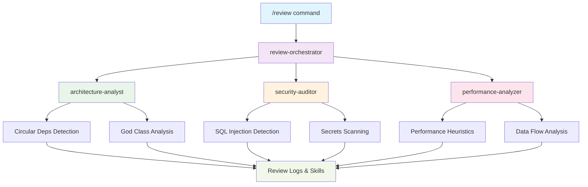

<div align="center">

# 🦎 Newt

[](https://opensource.org/licenses/MIT)
[](https://github.com/your-repo/newt)
[](https://claude.ai)
[](https://modelcontextprotocol.io)

> **AI-Powered Development Assistant** for architecture, security, performance, and quality automation

---

</div>

## 🌟 Overview

`Newt` is a comprehensive AI development assistant plugin that transforms how you review, plan, and improve code. Built for **Claude Code**, **Windsurf**, and **Cursor**, it provides intelligent automation across your entire development lifecycle.

### ✨ Key Capabilities

<div align="center">

| 🔍 **Code Review Automation** | 🚀 **PR Review Intelligence** | 💡 **Structured Brainstorming** | ⚡ **Continuous Quality** |
|------------------------------|------------------------------|----------------------------------|--------------------------|
| Architecture analysis | Commit planning | Ideation sessions | Real-time suggestions |
| Security audits | PR splitting | Decision artifacts | Automated skills |
| Performance insights | Review-ready summaries | ADR generation | Quality monitoring |

</div>

---

## 🚀 Quick Start

### 📦 Installation

```bash
# Clone or download the plugin
cd /path/to/your/workspace

# Install in Claude Code/Windsurf/Cursor
/plugin marketplace add ./newt
/plugin install newt

# Verify installation
/review --help
```

### ⚡ First Review

```bash
# Run a quick code review
/review --path src/auth --depth quick

# Check project health
/project-health

# Review your staged changes before commit
/pr-review --staged
```

### ⚙️ Configuration

Edit `config/default.yml` to customize thresholds, policies, and integrations.

📖 **See `docs/installation-guide.md` for detailed setup instructions.**

---

## 🔌 MCP (Model Context Protocol)

Newt ships with a native MCP server under `mcp/server.mjs` for seamless integration with MCP-capable clients like **Claude Desktop**.

### 🏃 Run MCP Server

```bash
npm install
npm run mcp:server
```

### 🔧 Claude Desktop Configuration

```json
{
  "mcpServers": {
    "newt": {
      "command": "node",
      "args": ["mcp/server.mjs"],
      "cwd": "/absolute/path/to/newt"
    }
  }
}
```

### 📋 Available Resources

| Resource | Description |
|----------|-------------|
| `config://default.yml` | Main configuration file |
| `config://schema.json` | Configuration schema |
| `logs://reviews/latest` | Latest review logs |
| `logs://brainstorm/latest` | Latest brainstorm sessions |
| `agents://list` | Available agents |
| `skills://list` | Available skills |

### 🛠️ MCP Tools

Newt MCP tools return **deterministic runbooks** for execution in your agentic IDE:

- `newt_review` - Comprehensive code review
- `newt_pr_review` - Pull request analysis  
- `newt_brainstorm` - Structured ideation
- `newt_converge` - Idea convergence
- `newt_experiment_brief` - Experiment planning
- `newt_adr_draft` - Architecture decision records

📖 **See `mcp/README.md` for complete details.**

---

## 🎯 Features

<div align="center">

### 🏗️ **Multi-Agent Architecture**
- Coordinated review orchestrator
- Specialized domain agents
- Deterministic output templates

### 🔒 **Production-Grade Analysis**
- Architecture pattern validation
- OWASP-aligned security scans
- Performance bottleneck detection

### 🤖 **Intelligent Automation**
- Automated skills on every change
- Slash commands for on-demand reviews
- Persistent logging and history

### 📊 **PR Workflow Excellence**
- Commit planning and splitting
- Review-ready summaries
- Large PR management

### 💭 **Structured Ideation**
- Brainstorming sessions
- Decision artifacts (ADRs, briefs)
- Cross-domain pattern imports

</div>

---

## 🏛️ Architecture Overview



---

## 📥 Installation Guide

### Step 1: Open Command Palette
Open Claude Code command palette (`Ctrl/Cmd + Shift + P`)

### Step 2: Install Plugin
```bash
/plugin marketplace add ./newt
/plugin install newt
```

### Step 3: Reload if Prompted
Reload plugins when prompted to complete installation.

---

## 🎮 Available Commands

| Command | Description | Example |
|---------|-------------|---------|
| `/review` | Full code review (architecture, security, performance, quality) | `/review src/auth --depth full` |
| `/project-health` | Health score with risks and debt areas | `/project-health` |
| `/review-history` | Summarizes past reviews and recurring issues | `/review-history --limit 5` |
| `/architecture-check` | Deep structural validation | `/architecture-check services/billing` |
| `/pr-review` | Reviews changes and suggests commits/PR splits | `/pr-review --staged` |
| `/brainstorm` | Structured ideation with decision artifacts | `/brainstorm --topic authentication` |
| `/converge` | Scores and converges ideas to top candidates | `/converge --ideas 10` |
| `/experiment-brief` | Creates executable experiment plans | `/experiment-brief --idea "OAuth flow"` |
| `/adr-draft` | Drafts architecture decision records | `/adr-draft --decision "Microservices"` |

---

## 🤖 Agent Ecosystem

<div align="center">

### 🎯 **Review Agents**
| Agent | Role | Expertise |
|-------|------|-----------|
| **review-orchestrator** | Central coordinator | Workflow management, result synthesis |
| **architecture-analyst** | Structure validator | Patterns, coupling, layering |
| **security-auditor** | Security scanner | OWASP, injections, secrets |
| **performance-analyzer** | Performance expert | Bottlenecks, algorithms, queries |

### 🚀 **PR Agents**  
| Agent | Role | Expertise |
|-------|------|-----------|
| **pr-review-agent** | Continuous PR companion | Staged review, PR splitting |
| **pr-planning-agent** | Strategic planner | Commit boundaries, dependencies |
| **pr-communication-agent** | Communication expert | PR descriptions, summaries |

### 💡 **Ideation Agents**
| Agent | Role | Expertise |
|-------|------|-----------|
| **brainstorming-agent** | Session facilitator | Structured ideation, artifacts |
| **creative-pattern-agent** | Pattern importer | Cross-domain patterns, practices |
| **constraint-analysis-agent** | Constraint extractor | Assumptions, relaxation options |
| **convergence-agent** | Idea scorer | Deterministic scoring, selection |
| **experiment-designer-agent** | Plan creator | Testable experiment design |

</div>

---

## 🔧 Skills & Automation

| Skill | Purpose | Trigger | Language Support |
|-------|---------|---------|------------------|
| **detect-god-class** | Flags oversized, multi-responsibility classes | Any code change | TypeScript, Python, Java |
| **detect-circular-deps** | Cycle detection on dependency graphs | Code changes | JavaScript, Python |
| **detect-sql-injection** | Scans for concatenation and unbound parameters | SQL code changes | SQL, ORMs |
| **dependency-audit** | Checks for vulnerable packages | Package file changes | npm, pip, maven |

---

## 📊 Logging & Analytics

### 📝 Review Logs
- Every `/review` creates `logs/reviews/YYYY-MM-DD_HHMM.md`
- **Metadata**: date, files analyzed, issues found, recommendations
- **Analytics**: agents invoked, execution time, severity distribution

### 📈 History Analysis
- `/review-history` aggregates and analyzes historical data
- **Trends**: recurring issues, hotspots, improvement metrics
- **Reports**: executive summaries, technical debt tracking

---

## 💡 Usage Examples

### 🎯 Focused Review
```bash
# Review authentication module
/review src/auth --depth full --focus security

# Architecture-only review
/review services/ --agents architecture-analyst
```

### 📊 Health Assessment
```bash
# Full project health check
/project-health --output json

# Health with trend analysis
/project-health --history 30
```

### 🚀 PR Workflow
```bash
# Review staged changes
/pr-review --staged --suggest-commits

# Review entire branch
/pr-review --branch feature/auth --split-large-prs
```

### 💭 Ideation Session
```bash
# Brainstorm authentication improvements
/brainstorm --topic "Multi-factor auth" --patterns cross-domain

# Converge on top ideas
/converge --from brainstorm --top 3
```

---

## 🔧 Troubleshooting

This section covers common issues and solutions for getting Newt working in Windsurf and Cursor.

### 🚨 Common Issues

#### Plugin Not Recognized
**Problem**: Commands like `/review` or `/project-health` show "command not found"

**Solutions**:
1. **Check Installation Location**
   ```bash
   # Verify plugin is in correct Windsurf directory
   Get-ChildItem -Path "$env:APPDATA\Windsurf\plugins\newt" -Force
   ```

2. **Manual Plugin Installation**
   ```bash
   # Copy plugin manually if automatic install fails
   Copy-Item -Path ".claude-plugin" -Destination "$env:APPDATA\Windsurf\plugins\newt" -Recurse -Force
   ```

3. **Restart IDE Completely**
   - Close Windsurf/Cursor completely
   - Wait 10 seconds
   - Reopen IDE

#### Commands Work in Chat but Not All Available
**Problem**: Only `/review` works, but `/project-health`, `/brainstorm`, etc. don't appear

**Solutions**:
1. **Check Plugin Manifest**
   ```bash
   # Verify all commands are listed in plugin.json
   Get-Content "$env:APPDATA\Windsurf\plugins\newt\plugin.json"
   ```

2. **Try Different Command Variations**
   ```bash
   # Try without arguments first
   /project-health
   
   # Try alternative naming
   /projectHealth
   /project_health
   ```

3. **Use Command Palette**
   - Press `Ctrl+Shift+P`
   - Search for "Newt" commands
   - Execute from palette instead of chat

#### Plugin Shows "No Matching Commands"
**Problem**: Command palette shows no Newt commands

**Solutions**:
1. **Verify Plugin Loading**
   ```bash
   # Check if plugin is actually loaded
   Get-ChildItem -Path "$env:APPDATA\Windsurf\logs" -Recurse -Force | Where-Object {$_.Name -like "*plugin*"}
   ```

2. **Check Plugin Configuration**
   ```bash
   # Verify plugin.json structure
   node scripts/validate-plugin.js
   ```

3. **Try Alternative Installation Method**
   ```bash
   # Install from different location
   /plugin marketplace add /full/path/to/newt
   /plugin install newt
   ```

### 🔍 IDE-Specific Issues

#### Windsurf-Specific

**Issue**: Commands work but suggestions don't appear in chat

**Solutions**:
1. **Check Chat Interface**
   - Ensure you're in Windsurf's chat panel, not terminal
   - Look for chat icon in sidebar
   - Try typing `/` to see suggestions

2. **Check Plugin Compatibility**
   ```bash
   # Verify Windsurf version compatibility
   # Some features may require specific Windsurf versions
   ```

3. **Clear Cache**
   ```bash
   # Clear Windsurf cache and restart
   Remove-Item -Path "$env:APPDATA\Windsurf\Cache" -Recurse -Force
   ```

#### Cursor-Specific

**Issue**: Plugin installs but commands don't work

**Solutions**:
1. **Check Cursor Plugin Directory**
   ```bash
   # Cursor may use different plugin directory
   Get-ChildItem -Path "$env:APPDATA\Cursor\plugins" -Force -Recurse
   ```

2. **Verify Cursor Version**
   ```bash
   # Check if Cursor version supports Claude Code plugins
   # May need different installation method
   ```

### 🛠️ Advanced Troubleshooting

#### Plugin Validation

```bash
# Run comprehensive plugin validation
npm run validate:plugin

# Check all plugin components
node scripts/validate-plugin.js
```

#### Manual Plugin Testing

```bash
# Test MCP server directly
npm run mcp:server

# Test specific commands manually
node -e "console.log('Testing plugin...')"
```

#### Log Analysis

```bash
# Check Windsurf logs for plugin errors
Get-ChildItem -Path "$env:APPDATA\Windsurf\logs" -Recurse -Force | Sort-Object LastWriteTime -Descending | Select-Object -First 3

# Check latest log for errors
Get-Content "$env:APPDATA\Windsurf\logs\20260306T173805\*" -Tail 20
```

### 🎯 Quick Fix Checklist

#### Before Submitting Issue

1. ✅ **Plugin Installation Verified**
   ```bash
   Get-ChildItem -Path "$env:APPDATA\Windsurf\plugins\newt" -Force
   ```

2. ✅ **Plugin Configuration Valid**
   ```bash
   node scripts/validate-plugin.js
   ```

3. ✅ **IDE Restarted Completely**
   - Closed IDE fully
   - Waited 10+ seconds
   - Reopened IDE

4. ✅ **Correct Interface Used**
   - Using chat interface, not terminal
   - Command palette shows Newt commands

5. ✅ **Basic Command Works**
   ```bash
   /review
   ```

#### If Still Not Working

1. **Try Alternative Installation**
   ```bash
   # Remove existing installation
   Remove-Item -Path "$env:APPDATA\Windsurf\plugins\newt" -Recurse -Force
   
   # Reinstall with different method
   /plugin marketplace add /full/path/to/newt
   /plugin install newt
   ```

2. **Check for Conflicts**
   ```bash
   # Check for other plugins that might conflict
   Get-ChildItem -Path "$env:APPDATA\Windsurf\plugins" -Force
   ```

3. **Report with Details**
   Include in your issue report:
   - IDE version (Windsurf/Cursor)
   - Operating system
   - Plugin version
   - Exact error messages
   - Steps tried

### 📞 Getting Help

#### Community Support
- **Discord**: [discord.gg/newt](https://discord.gg/newt)
- **GitHub Discussions**: [github.com/newt/templates/discussions](https://github.com/newt/templates/discussions)

#### Troubleshooting Commands
```bash
# Check plugin status
/hook:status

# Validate configuration
/hook:validate

# Test specific hook
/hook:test pre-commit

# List available hooks
/hook:list
```

#### Debug Mode
```yaml
# Add to .newt/hooks.yml for debugging
global:
  log_level: debug
  log_file: logs/hooks.log
```

### 🔄 Common Workflows

#### Fresh Installation
```bash
# 1. Clean slate
Remove-Item -Path "$env:APPDATA\Windsurf\plugins\newt" -Recurse -Force

# 2. Restart IDE
# Close and reopen Windsurf/Cursor

# 3. Install plugin
/plugin marketplace add ./newt
/plugin install newt

# 4. Verify installation
/review
```

#### Plugin Update
```bash
# 1. Remove old version
/plugin uninstall newt

# 2. Install new version
/plugin marketplace add ./newt
/plugin install newt

# 3. Verify commands work
/review
/project-health
```

#### Reset Configuration
```bash
# Reset to defaults
Remove-Item -Path ".newt/hooks.yml" -Force
/hook:install --defaults
```

---

## 🤝 Contributing

We welcome contributions! Please see our contributing guidelines for details on:

- 🐛 **Bug Reports**: How to report issues effectively
- 💡 **Feature Requests**: Proposing new capabilities  
- 🔧 **Code Contributions**: Development setup and PR process
- 📚 **Documentation**: Improving guides and examples

---

## 📄 License

This project is licensed under the MIT License - see the [LICENSE](LICENSE) file for details.

---

## 🆘 Support

For enhancements, troubleshooting, or questions:

- 📋 **Issues**: Open an issue in your internal repo
- 🔧 **Extensions**: Modify agents/skills as needed
- 📖 **Documentation**: Check `docs/` for detailed guides
- 💬 **Community**: Join discussions in your team channels

---

<div align="center">

**Built with ❤️ for the modern development workflow**

[⬆️ Back to top](#-newt)

</div>
