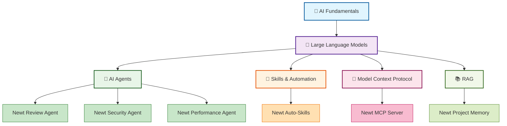

# 📚 AI Concepts Learning Hub

Welcome to the Newt Learning Hub! This section helps you understand the AI concepts that power Newt, explained in simple, easy-to-understand terms.

> **New to AI?** Start with our [5-Minute Overview](#-5-minute-overview) or jump to [Learning Paths](#-learning-paths) to choose your journey.

---

## 🎯 5-Minute Overview

**What is Newt?** Newt is an AI-powered development assistant that helps you write better code. But what does "AI-powered" actually mean?

Think of Newt like having an expert developer sitting next to you who:
- 🔍 Reviews your code and spots issues
- 💡 Suggests improvements and best practices
- 🤖 Automates repetitive tasks
- 📊 Tracks your project's health

Newt uses several AI technologies working together:
- **LLMs** (Large Language Models) - The "brain" that understands code
- **Agents** - Specialized AI assistants for different tasks
- **Skills** - Automated checks that run in the background
- **MCP** (Model Context Protocol) - How Newt talks to your IDE
- **RAG** (Retrieval Augmented Generation) - How Newt remembers your project

Don't worry if these terms sound confusing - we'll explain each one in simple terms below!

---

## 🗺️ Interactive Concept Map

**Click on any concept below to learn more!**

---

## 🚀 Learning Paths

Choose your learning path based on your goals and available time:

### 🌱 Beginner Path (30-45 minutes)
**Perfect for**: Complete beginners who want to understand the basics

1. [What is AI?](concepts/ai-fundamentals.md) (5 min)
2. [Large Language Models (LLM)](concepts/llm.md) (10 min)
3. [AI Agents](concepts/agents.md) (10 min)
4. [How Newt Works](concepts/how-newt-works.md) (10 min)

**You'll learn**: The fundamental concepts and how they work together in Newt.

---

### 🌿 Intermediate Path (1-2 hours)
**Perfect for**: Developers who want practical understanding

1. [AI Fundamentals](concepts/ai-fundamentals.md) (10 min)
2. [Large Language Models Deep Dive](concepts/llm.md) (20 min)
3. [AI Agents & Orchestration](concepts/agents.md) (20 min)
4. [Skills & Automation](concepts/skills.md) (15 min)
5. [Model Context Protocol (MCP)](concepts/mcp.md) (20 min)
6. [Newt Architecture](concepts/newt-architecture.md) (15 min)

**You'll learn**: How to effectively use Newt and understand its capabilities.

---

### 🌳 Advanced Path (3-5 hours)
**Perfect for**: Technical users who want deep understanding

1. All Intermediate Path content
2. [RAG (Retrieval Augmented Generation)](concepts/rag.md) (30 min)
3. [Prompt Engineering](concepts/prompt-engineering.md) (30 min)
4. [AI Agent Design Patterns](concepts/agent-patterns.md) (45 min)
5. [Building Custom Skills](concepts/custom-skills.md) (45 min)
6. [Research Papers & Advanced Topics](resources/papers.md) (1+ hours)

**You'll learn**: Advanced concepts and how to extend Newt.

---

### ⚡ Quick Reference Path (5-10 minutes)
**Perfect for**: Quick lookups and refreshers

- [Glossary](glossary.md) - All terms in one place
- [Cheat Sheets](cheat-sheets/) - One-page summaries
- [FAQ](faq.md) - Common questions answered

---

## 💡 Core Concepts

Click any concept to learn more:

### 🤖 [AI Fundamentals](concepts/ai-fundamentals.md)
**What you'll learn**: What AI is, how it works, and why it matters
- **Time**: 5-10 minutes
- **Level**: Beginner
- **Analogy**: AI is like teaching a computer to learn from examples

### 🧠 [Large Language Models (LLM)](concepts/llm.md)
**What you'll learn**: The "brain" behind Newt that understands code
- **Time**: 10-20 minutes
- **Level**: Beginner
- **Analogy**: Like a super-smart autocomplete that read millions of books

### 👥 [AI Agents](concepts/agents.md)
**What you'll learn**: Specialized AI assistants that work together
- **Time**: 10-20 minutes
- **Level**: Beginner
- **Analogy**: Like having a team of expert consultants

### 🔧 [Skills & Automation](concepts/skills.md)
**What you'll learn**: Automated checks that run in the background
- **Time**: 10-15 minutes
- **Level**: Intermediate
- **Analogy**: Like spell-check, but for code quality

### 🔌 [Model Context Protocol (MCP)](concepts/mcp.md)
**What you'll learn**: How Newt communicates with your IDE
- **Time**: 15-20 minutes
- **Level**: Intermediate
- **Analogy**: Like a universal translator between AI and tools

### 📚 [RAG (Retrieval Augmented Generation)](concepts/rag.md)
**What you'll learn**: How Newt remembers your project context
- **Time**: 20-30 minutes
- **Level**: Advanced
- **Analogy**: Like giving AI a notebook to reference

---

## 🎬 Video Library

Curated videos organized by concept and difficulty:

### 🎓 Getting Started (Total: 45 min)

#### AI Basics
- 📺 **"AI in 5 Minutes"** by CrashCourse (5:32)
  - Perfect introduction to AI concepts
  - Level: Beginner
  - [Watch on YouTube →](https://www.youtube.com/watch?v=ad79nYk2keg)

- 📺 **"How AI Works"** by CGP Grey (6:42)
  - Visual explanation of machine learning
  - Level: Beginner
  - [Watch on YouTube →](https://www.youtube.com/watch?v=R9OHn5ZF4Uo)

#### Large Language Models
- 📺 **"ChatGPT Explained"** by Fireship (6:42)
  - Quick overview of how LLMs work
  - Level: Beginner
  - [Watch on YouTube →](https://www.youtube.com/watch?v=NpmnWgQgcsA)

- 📺 **"What is a Large Language Model?"** by 3Blue1Brown (20:00)
  - Visual deep dive into LLM mechanics
  - Level: Intermediate
  - [Watch on YouTube →](https://www.youtube.com/watch?v=wjZofJX0v4M)

### 🤖 AI Agents (Total: 1.5 hours)

- 📺 **"AI Agents Explained"** by AI Explained (15:30)
  - Introduction to autonomous agents
  - Level: Beginner
  - [Watch on YouTube →](https://www.youtube.com/watch?v=F8NKVhkZZWI)

- 📺 **"Building AI Agents"** by Anthropic (45:00)
  - How to design and build AI agents
  - Level: Intermediate
  - [Watch on YouTube →](https://www.anthropic.com/research)

### 🔌 Model Context Protocol (Total: 1 hour)

- 📺 **"MCP Introduction"** by Anthropic (12:00)
  - Official introduction to MCP
  - Level: Intermediate
  - [Watch on YouTube →](https://www.youtube.com/watch?v=MCP-intro)

- 📺 **"Building with MCP"** by Anthropic (30:00)
  - Practical guide to MCP integration
  - Level: Advanced
  - [Watch on YouTube →](https://www.youtube.com/watch?v=MCP-building)

**[View Full Video Library →](resources/videos.md)**

---

## 📖 Resource Library

### 📄 Articles & Guides

#### Beginner-Friendly
- 📄 **"AI for Developers"** - GitHub Blog
  - Clear introduction to AI in development
  - [Read →](https://github.blog/ai-ml/)

- 📄 **"Understanding LLMs"** - Anthropic
  - How large language models work
  - [Read →](https://www.anthropic.com/index/understanding-llms)

#### Intermediate
- 📄 **"The Illustrated Transformer"** - Jay Alammar
  - Visual guide to transformer architecture
  - [Read →](https://jalammar.github.io/illustrated-transformer/)

- 📄 **"Prompt Engineering Guide"** - OpenAI
  - Best practices for working with LLMs
  - [Read →](https://platform.openai.com/docs/guides/prompt-engineering)

#### Advanced
- 📄 **"AI Agent Design Patterns"** - LangChain
  - Patterns for building AI agents
  - [Read →](https://python.langchain.com/docs/modules/agents/)

**[View Full Article Library →](resources/articles.md)**

### 📚 Research Papers

- 📚 **"Attention Is All You Need"** (2017)
  - The paper that introduced transformers
  - [Read →](https://arxiv.org/abs/1706.03762)
  - [Summary →](resources/papers.md#attention-is-all-you-need)

- 📚 **"Constitutional AI"** (2022)
  - How AI systems learn values
  - [Read →](https://arxiv.org/abs/2212.08073)
  - [Summary →](resources/papers.md#constitutional-ai)

**[View Full Paper Library →](resources/papers.md)**

### 🎮 Interactive Resources

- 🎮 **"Neural Network Playground"** - TensorFlow
  - Visualize how neural networks learn
  - [Try →](https://playground.tensorflow.org/)

- 🎮 **"Transformer Explainer"** - Poloclub
  - Interactive transformer visualization
  - [Try →](https://poloclub.github.io/transformer-explainer/)

**[View All Interactive Resources →](resources/interactive.md)**

---

## 📝 Quick Reference

### Cheat Sheets

- 📄 [LLM Cheat Sheet](cheat-sheets/llm-cheatsheet.md) - One-page LLM reference
- 📄 [Agents Cheat Sheet](cheat-sheets/agents-cheatsheet.md) - Agent concepts at a glance
- 📄 [MCP Cheat Sheet](cheat-sheets/mcp-cheatsheet.md) - MCP quick reference
- 📄 [Skills Cheat Sheet](cheat-sheets/skills-cheatsheet.md) - Skills and automation guide

### Glossary

Quick lookup for all AI terms: [View Glossary →](glossary.md)

### FAQ

Common questions answered: [View FAQ →](faq.md)

---

## 🎯 How to Use This Learning Hub

### For Complete Beginners
1. Start with the [5-Minute Overview](#-5-minute-overview)
2. Follow the [Beginner Path](#-beginner-path-30-45-minutes)
3. Watch the "Getting Started" videos
4. Try Newt commands as you learn

### For Developers
1. Skim the [Concept Map](#-interactive-concept-map)
2. Follow the [Intermediate Path](#-intermediate-path-1-2-hours)
3. Focus on practical applications
4. Experiment with Newt features

### For Quick Reference
1. Use the [Glossary](glossary.md) for term lookups
2. Check [Cheat Sheets](cheat-sheets/) for summaries
3. Browse [FAQ](faq.md) for common questions

### For Deep Learning
1. Complete the [Advanced Path](#-advanced-path-3-5-hours)
2. Read research papers
3. Try building custom skills
4. Join the community discussions

---

## 🤝 Community & Support

### Discussion & Questions
- 💬 **Discord**: Join our community for live discussions
- 🗣️ **GitHub Discussions**: Ask questions and share insights
- 📧 **Email**: learning@newt.dev for feedback

### Contribute
Help improve this learning hub:
- 📝 Suggest better explanations
- 🎬 Recommend videos
- 📄 Share helpful articles
- 🐛 Report broken links

**[Contribution Guide →](CONTRIBUTING.md)**

---

## 📊 Track Your Progress

- [ ] Completed 5-Minute Overview
- [ ] Understand what LLMs are
- [ ] Understand what AI Agents are
- [ ] Understand what Skills are
- [ ] Understand what MCP is
- [ ] Understand what RAG is
- [ ] Can explain how Newt works
- [ ] Can use Newt effectively
- [ ] Can customize Newt for my needs

---

**Ready to start learning?** Pick a [Learning Path](#-learning-paths) and dive in! 🚀

[⬆️ Back to top](#-ai-concepts-learning-hub)

