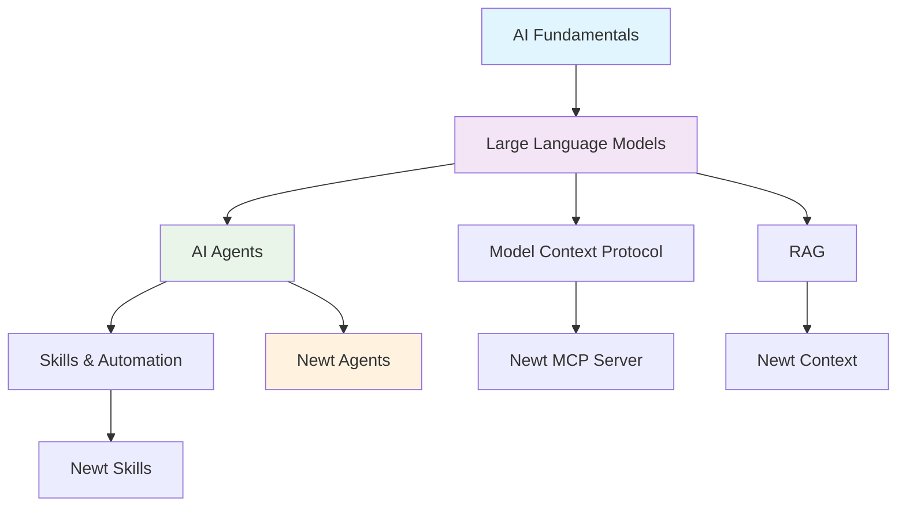

## Objective
Design an accessible, beginner-friendly learning section that explains AI development concepts (MCP, RAG, Skills, Agents, LLM) in simple terms with rich multimedia resources (YouTube videos, papers, websites) and easy navigation.

## Success Metrics
- 90%+ comprehension rate for non-technical readers
- Clear progression from basics to advanced concepts
- Rich multimedia resource library
- Easy navigation with visual aids
- Practical examples that relate to Newt

## Constraints
- Must be non-technical and accessible
- Should avoid jargon or explain it clearly
- Must include diverse learning resources (video, text, interactive)
- Should be visually appealing and easy to navigate
- Must relate concepts back to Newt's functionality
- Should accommodate different learning styles

## Idea Landscape

### Content Structure Ideas

1. **Progressive Learning Path**
   - Start with "What is AI?" fundamentals
   - Build up to specific concepts (LLM → Agents → Skills → MCP → RAG)
   - Each concept builds on previous knowledge
   - Clear prerequisites for each section

2. **Concept Cards with Analogies**
   - Each concept explained with real-world analogy
   - Visual diagrams and illustrations
   - "In Newt" section showing practical application
   - Quick reference cards for each concept

3. **Interactive Learning Journey**
   - Choose-your-own-path navigation
   - Quizzes and knowledge checks
   - Interactive demos and examples
   - Progress tracking

4. **Video-First Approach**
   - Curated YouTube playlists for each concept
   - Embedded videos with timestamps
   - Video summaries for quick reference
   - Mix of beginner and advanced content

5. **Glossary + Deep Dive Structure**
   - Quick glossary for rapid lookup
   - Deep dive articles for each concept
   - Cross-references between related concepts
   - Expandable sections for more detail

### Content Format Ideas

6. **ELI5 (Explain Like I'm 5) Format**
   - Simple language explanations
   - Everyday analogies (restaurant, library, assistant)
   - No technical jargon
   - Friendly, conversational tone

7. **Visual Learning Focus**
   - Infographics for each concept
   - Flowcharts showing relationships
   - Diagrams of how systems work
   - Mermaid charts for technical flow

8. **Story-Based Learning**
   - Narrative explaining AI development journey
   - Character-based examples
   - Real-world scenarios
   - Problem-solution format

9. **Comparison Tables**
   - Side-by-side concept comparisons
   - "Before AI vs. With AI" examples
   - Traditional vs. AI-powered approaches
   - When to use what

10. **Hands-On Examples**
    - Live Newt examples for each concept
    - Try-it-yourself sections
    - Code snippets with explanations
    - Interactive playgrounds

### Resource Organization Ideas

11. **Curated Resource Library**
    - Categorized by concept and difficulty
    - Star ratings and recommendations
    - Time estimates for each resource
    - Multiple formats (video, article, paper, interactive)

12. **Learning Paths**
    - Beginner path (0-2 hours)
    - Intermediate path (2-5 hours)
    - Advanced path (5+ hours)
    - Quick reference path (15 minutes)

13. **Multi-Format Resources**
    - YouTube videos with chapters
    - Research papers with summaries
    - Blog posts and articles
    - Podcasts and interviews
    - Interactive tutorials

14. **Community Resources**
    - Discussion forums
    - Q&A sections
    - User-contributed examples
    - Expert interviews

### Navigation Ideas

15. **Tabbed Interface**
    - Tabs for each major concept
    - Sub-tabs for detail levels
    - Quick jump navigation
    - Breadcrumb trails

16. **Visual Concept Map**
    - Interactive mind map
    - Click to explore concepts
    - Shows relationships between ideas
    - Color-coded by difficulty

17. **Search + Filter**
    - Search by keyword
    - Filter by difficulty level
    - Filter by resource type
    - Filter by time commitment

18. **Progressive Disclosure**
    - Start with simple overview
    - Expand for more detail
    - Collapsible sections
    - "Learn more" links

### Engagement Ideas

19. **Practical Newt Examples**
    - How Newt uses each concept
    - Real command examples
    - Behind-the-scenes explanations
    - Architecture diagrams

20. **Common Misconceptions**
    - "What it's NOT" sections
    - Myth-busting
    - Common confusions addressed
    - Clear clarifications

21. **Why It Matters**
    - Practical benefits explained
    - Real-world impact
    - Career relevance
    - Future trends

22. **Quick Wins**
    - 5-minute concept summaries
    - Key takeaways
    - Cheat sheets
    - One-pagers

## Clusters

### Cluster 1: Content Structure & Navigation
**Focus**: How to organize and present information
- Progressive learning path
- Tabbed interface
- Visual concept map
- Search + filter
- Progressive disclosure
- Glossary + deep dive

### Cluster 2: Explanation Methods
**Focus**: How to explain complex concepts simply
- ELI5 format
- Concept cards with analogies
- Story-based learning
- Comparison tables
- Common misconceptions
- Why it matters

### Cluster 3: Visual & Interactive Elements
**Focus**: Engaging visual learning
- Visual learning focus (infographics, diagrams)
- Interactive learning journey
- Hands-on examples
- Visual concept map
- Practical Newt examples

### Cluster 4: Resource Curation
**Focus**: External learning materials
- Curated resource library
- Video-first approach
- Multi-format resources
- Learning paths
- Community resources

### Cluster 5: Quick Reference & Accessibility
**Focus**: Fast access to information
- Quick wins (summaries, cheat sheets)
- Glossary
- Search functionality
- One-pagers
- Key takeaways

## Top Candidates

### 1. **Progressive Learning Hub with Visual Navigation** (Highest Priority)

**Description**: A comprehensive learning section with progressive difficulty levels, visual concept maps, and multiple learning paths.

**Structure**:
```
📚 AI Concepts Learning Hub
├── 🎯 Start Here (5-minute overview)
├── 🗺️ Concept Map (interactive visual)
├── 📖 Learning Paths
│   ├── Beginner (0-2 hours)
│   ├── Intermediate (2-5 hours)
│   └── Advanced (5+ hours)
├── 💡 Core Concepts
│   ├── What is AI?
│   ├── Large Language Models (LLM)
│   ├── AI Agents
│   ├── Skills & Automation
│   ├── Model Context Protocol (MCP)
│   └── RAG (Retrieval Augmented Generation)
├── 🎬 Video Library
├── 📄 Resource Library
├── 🔍 Glossary
└── ❓ FAQ
```

**Features**:
- Visual concept map showing relationships
- Progressive disclosure (simple → detailed)
- Multiple learning paths for different goals
- Rich multimedia resources
- Practical Newt examples throughout

### 2. **ELI5 Concept Cards with Analogies** (High Priority)

**Description**: Each concept explained using simple analogies and real-world examples, presented as digestible cards.

**Format for Each Concept**:
```markdown
## 🤖 [Concept Name]

### 🎯 In Simple Terms
[One-sentence explanation]

### 🏠 Real-World Analogy
[Relatable comparison to everyday experience]

### 💡 How Newt Uses This
[Practical example in Newt]

### 📺 Learn More
- [Video] Beginner-friendly introduction (10 min)
- [Article] Deep dive explanation
- [Interactive] Try it yourself

### ✅ Key Takeaways
- Point 1
- Point 2
- Point 3
```

**Example - LLM Card**:
```markdown
## 🤖 Large Language Models (LLM)

### 🎯 In Simple Terms
An LLM is like a super-smart autocomplete that can understand and generate human-like text.

### 🏠 Real-World Analogy
Think of an LLM like a librarian who has read millions of books and can answer questions, write stories, or help with tasks based on all that knowledge.

### 💡 How Newt Uses This
Newt uses an LLM (Claude) to understand your code, find issues, and provide intelligent suggestions - just like having an expert developer review your work.

### 📺 Learn More
- [Video] "What is a Large Language Model?" by 3Blue1Brown (20 min)
- [Article] "LLMs Explained" on Anthropic's website
- [Interactive] Try Claude.ai to see an LLM in action

### ✅ Key Takeaways
- LLMs are trained on vast amounts of text
- They predict the most likely next words
- They can understand context and generate helpful responses
```

### 3. **Video-First Resource Library** (High Priority)

**Description**: Curated collection of YouTube videos, organized by concept and difficulty, with timestamps and summaries.

**Organization**:
```markdown
## 📺 Video Library

### 🎬 Getting Started (Total: 45 min)
1. **"AI in 5 Minutes"** by CrashCourse
   - Duration: 5:32
   - Level: Beginner
   - Key Topics: AI basics, history, applications
   - [Watch →](link)

2. **"How ChatGPT Works"** by Fireship
   - Duration: 6:42
   - Level: Beginner
   - Key Topics: LLMs, training, prompting
   - [Watch →](link)

### 🤖 Large Language Models (Total: 2 hours)
[Curated playlist with progression]

### 🔧 AI Agents (Total: 1.5 hours)
[Curated playlist with progression]

[etc.]
```

**Features**:
- Time estimates for planning
- Difficulty ratings
- Key topics covered
- Curated playlists
- Video summaries

### 4. **Interactive Concept Map** (Medium Priority)

**Description**: Visual, clickable diagram showing how all AI concepts relate to each other and to Newt.

**Implementation**:


**Features**:
- Clickable nodes to learn more
- Color-coded by category
- Shows dependencies
- Highlights Newt integration

### 5. **Quick Reference Cheat Sheets** (Medium Priority)

**Description**: One-page summaries for each concept, perfect for quick lookup.

**Format**:
```markdown
# 📄 [Concept] Cheat Sheet

## What It Is
[One sentence]

## Key Points
- Point 1
- Point 2
- Point 3

## Common Uses
- Use case 1
- Use case 2

## In Newt
[How Newt uses it]

## Learn More
- [Resource 1]
- [Resource 2]
```

## Recommendations

### Phase 1: Foundation (Week 1-2)
1. **Create Core Structure**
   - Set up learning hub directory structure
   - Create main navigation page
   - Design concept card template
   - Build glossary foundation

2. **Develop ELI5 Concept Cards**
   - Write simple explanations for each concept
   - Create real-world analogies
   - Add "How Newt Uses This" sections
   - Include visual diagrams

3. **Curate Initial Video Library**
   - Find 3-5 videos per concept
   - Organize by difficulty
   - Add timestamps and summaries
   - Create playlists

### Phase 2: Content Development (Week 3-4)
4. **Build Learning Paths**
   - Beginner path (basics only)
   - Intermediate path (practical application)
   - Advanced path (deep technical)
   - Quick reference path (cheat sheets)

5. **Create Visual Elements**
   - Interactive concept map
   - Infographics for each concept
   - Flowcharts showing relationships
   - Diagrams of Newt architecture

6. **Develop Resource Library**
   - Curate articles and papers
   - Add interactive tutorials
   - Include podcasts and interviews
   - Organize by format and difficulty

### Phase 3: Enhancement (Week 5-6)
7. **Add Interactive Elements**
   - Hands-on Newt examples
   - Try-it-yourself sections
   - Knowledge check quizzes
   - Progress tracking

8. **Create Quick Reference Materials**
   - One-page cheat sheets
   - Key takeaways summaries
   - FAQ section
   - Common misconceptions

9. **Build Navigation & Search**
   - Implement search functionality
   - Add filters (difficulty, format, time)
   - Create breadcrumb navigation
   - Add "related concepts" links

### Phase 4: Polish & Launch (Week 7-8)
10. **User Testing**
    - Test with non-technical users
    - Gather feedback on clarity
    - Identify confusing sections
    - Iterate based on feedback

11. **Add Community Features**
    - Discussion sections
    - User-contributed examples
    - Q&A forum
    - Expert interviews

12. **Final Polish**
    - Proofread all content
    - Verify all links
    - Optimize images
    - Add accessibility features

## Decision Artifacts

### Architecture Decision Record: Learning Hub Structure

**Decision**: Implement a progressive learning hub with ELI5 concept cards, visual navigation, and curated multimedia resources.

**Context**:
- Users need to understand AI concepts to use Newt effectively
- Different users have different learning styles and time constraints
- Content must be accessible to non-technical audiences
- Resources should be diverse (video, text, interactive)

**Options Considered**:

1. **Single Long-Form Guide**
   - Pros: Comprehensive, linear progression
   - Cons: Overwhelming, hard to navigate, not flexible

2. **Wiki-Style Documentation**
   - Pros: Detailed, searchable, cross-referenced
   - Cons: Can be dry, technical, intimidating

3. **Progressive Learning Hub** (Selected)
   - Pros: Flexible, accessible, multiple formats, visual
   - Cons: More complex to build, requires curation

**Rationale**:
- Accommodates different learning styles (visual, video, reading)
- Allows users to choose their own path (beginner to advanced)
- Provides quick reference for experienced users
- Makes complex concepts accessible through analogies
- Integrates well with Newt's existing documentation

**Implementation Plan**:

```
docs/learning/
├── README.md (Learning Hub Home)
├── concepts/
│   ├── ai-fundamentals.md
│   ├── llm.md
│   ├── agents.md
│   ├── skills.md
│   ├── mcp.md
│   └── rag.md
├── paths/
│   ├── beginner.md
│   ├── intermediate.md
│   └── advanced.md
├── resources/
│   ├── videos.md
│   ├── articles.md
│   ├── papers.md
│   └── interactive.md
├── cheat-sheets/
│   ├── llm-cheatsheet.md
│   ├── agents-cheatsheet.md
│   └── [etc.]
├── glossary.md
└── faq.md
```

### Content Template: Concept Card

```markdown
---
title: [Concept Name]
difficulty: beginner|intermediate|advanced
time_to_learn: [X minutes]
prerequisites: [List of concepts]
related_concepts: [List of related topics]
---

# 🎯 [Concept Name]

> **TL;DR**: [One-sentence explanation]

## 📖 What Is It?

[2-3 paragraph explanation in simple terms]

## 🏠 Real-World Analogy

[Relatable comparison that makes the concept click]

### Example
[Concrete example of the analogy]

## 💡 How Newt Uses This

[Practical explanation of how this concept powers Newt]

### Try It Yourself
```bash
# Example Newt command that demonstrates this concept
/command --example
```

## 🎬 Learn More

### Videos (Total: X min)
- 📺 **"[Title]"** by [Creator] (X min) - [Description]
  - Level: Beginner
  - [Watch →](link)

### Articles
- 📄 **"[Title]"** - [Description]
  - Level: Intermediate
  - [Read →](link)

### Interactive
- 🎮 **"[Title]"** - [Description]
  - [Try →](link)

### Research Papers (Optional)
- 📚 **"[Title]"** - [Summary]
  - [Read →](link)

## ✅ Key Takeaways

- **Point 1**: [Key insight]
- **Point 2**: [Key insight]
- **Point 3**: [Key insight]

## ❓ Common Questions

**Q: [Question]**
A: [Answer]

**Q: [Question]**
A: [Answer]

## 🔗 Related Concepts

- [Concept 1] - [How it relates]
- [Concept 2] - [How it relates]

## 📝 Quick Reference

| Aspect | Description |
|--------|-------------|
| **What** | [Brief description] |
| **Why** | [Why it matters] |
| **When** | [When to use] |
| **How** | [How it works] |

---

**Next Steps**: [Link to next logical concept to learn]
```

### Resource Curation Guidelines

**Video Selection Criteria**:
- Clear audio and visuals
- Beginner-friendly language
- Under 20 minutes (or chaptered)
- Recent (within 2 years)
- High production quality
- Accurate information

**Article Selection Criteria**:
- Well-written and edited
- Includes examples
- Not overly technical
- Includes visuals
- Authoritative source
- Accessible without paywall

**Diversity Requirements**:
- Multiple formats per concept
- Range of difficulty levels
- Different teaching styles
- Various perspectives
- Mix of short and long content

---

*Generated by Newt Brainstorming Agent*
