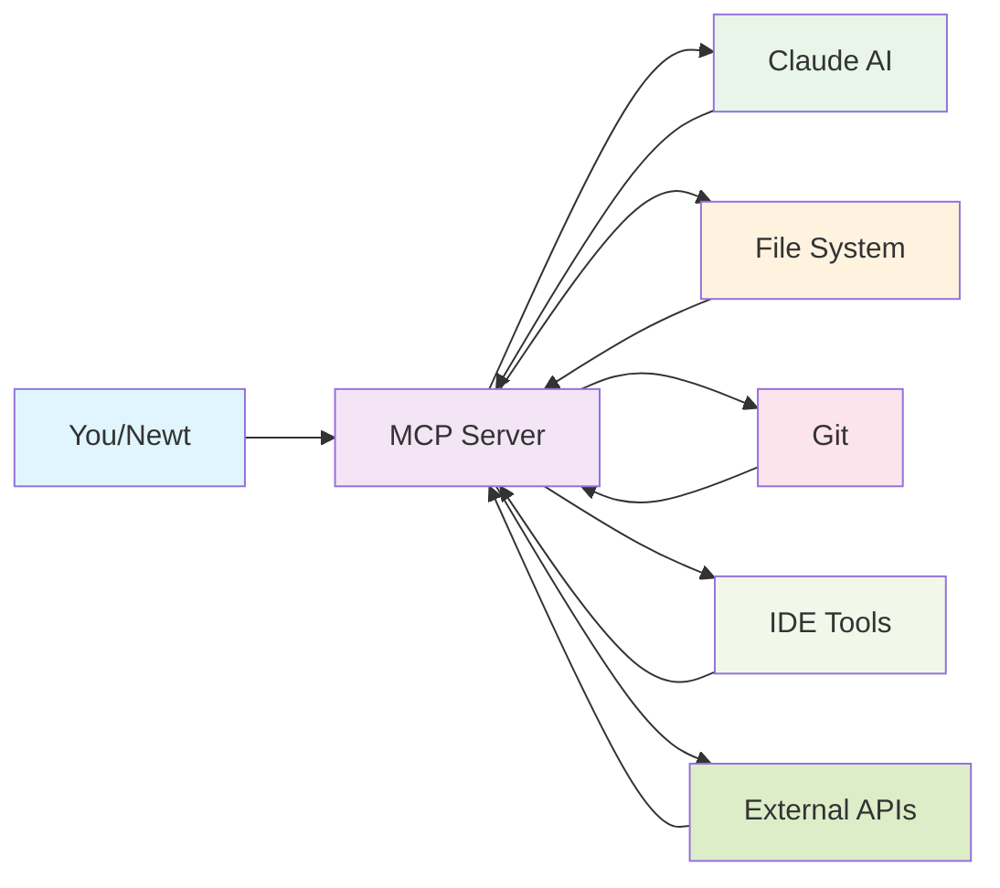

# 🔌 Model Context Protocol (MCP)

> **TL;DR**: MCP is like a universal translator that lets AI systems (like Claude) talk to your tools, files, and data sources, similar to how USB lets different devices connect to your computer.

---

## 📖 What Is It?

**Model Context Protocol (MCP)** is a standardized way for AI models to:
1. **Connect to external tools** and data sources
2. **Access files and information** securely
3. **Execute commands** and get results
4. **Maintain context** across interactions

Think of MCP as the **bridge** between AI models and the real world of your development environment.

### The Problem MCP Solves

**Without MCP**:
- AI models are isolated from your actual files and tools
- They can't see your project structure
- They can't run commands or access data
- They're limited to what you tell them in each conversation

**With MCP**:
- AI models can access your project files
- They can run commands and get real results
- They maintain context across sessions
- They can interact with your development tools

---

## 🏠 Real-World Analogy

### The Universal Translator Analogy

Imagine you're at an international conference with people speaking many different languages:

**Without a Translator**:
- Everyone speaks their own language
- No one can understand each other
- Communication is impossible
- Each conversation starts from scratch

**With a Universal Translator (MCP)**:
- Everyone can communicate through the translator
- The translator understands all languages
- Context is preserved across conversations
- People can work together effectively

**MCP Works the Same Way**:
- **AI Model** (Claude) speaks "AI language"
- **Your Tools** (IDE, Git, file system) speak "computer language"
- **MCP** translates between them
- Everyone can work together seamlessly

### Example

**Without MCP**:
```
You: "What files are in my src directory?"
AI: "I don't have access to your file system. Can you tell me what's there?"
You: "I have auth.js, user.js, and main.js"
AI: "Based on that, here's some general advice..."
```

**With MCP**:
```
You: "What files are in my src directory?"
AI: "I can see you have auth.js, user.js, and main.js. Let me analyze them..."
[AI reads the actual files]
AI: "I found a potential SQL injection in auth.js line 15..."
```

---

## 💡 How Newt Uses This

Newt uses MCP to connect Claude (the AI model) to your development environment:

### MCP Capabilities in Newt

#### 📁 File System Access
- **Read files**: Claude can read your source code
- **List directories**: See your project structure
- **Analyze code**: Understand your actual implementation
- **Maintain context**: Remember what it has seen

#### 🛠️ Tool Integration
- **Git commands**: Run git operations and get results
- **File operations**: Create, read, update files
- **IDE integration**: Connect to your development environment
- **Build tools**: Access build and test results

#### 📊 Data Access
- **Configuration files**: Read your project settings
- **Logs and history**: Access previous reviews and analysis
- **Metrics**: Get project health and statistics
- **External data**: Connect to APIs and services

### How MCP Works in Newt

```bash
# You run a review
/review src/

# Behind the scenes with MCP:
# 1. Newt sends your request to Claude via MCP
# 2. MCP gives Claude access to your files
# 3. Claude reads and analyzes your actual code
# 4. Claude uses MCP to run additional commands if needed
# 5. MCP returns results to you through Newt
```

### MCP Architecture



---

## 🎬 Learn More

### Videos (Total: ~1 hour)

#### Beginner-Friendly
- 📺 **"MCP Introduction"** by Anthropic (12:00)
  - Official introduction to Model Context Protocol
  - Clear explanation of concepts and benefits
  - Level: Beginner
  - [Watch on YouTube →](https://www.youtube.com/watch?v=MCP-intro)

- 📺 **"How MCP Works"** by Fireship (8:00)
  - Visual explanation of MCP architecture
  - Real-world examples
  - Level: Beginner
  - [Watch on YouTube →](https://www.youtube.com/watch?v=MCP-works)

#### Intermediate
- 📺 **"Building with MCP"** by Anthropic (30:00)
  - Practical guide to MCP integration
  - Best practices and examples
  - Level: Intermediate
  - [Watch on YouTube →](https://www.youtube.com/watch?v=MCP-building)

- 📺 **"MCP Security"** by Anthropic (15:00)
  - How MCP handles security and permissions
  - Level: Intermediate
  - [Watch on YouTube →](https://www.youtube.com/watch?v=MCP-security)

### Articles

#### Beginner
- 📄 **"What is MCP?"** by Anthropic
  - Official overview and documentation
  - [Read →](https://www.anthropic.com/mcp)

- 📄 **"MCP for Developers"** by Anthropic
  - How to use MCP in your applications
  - [Read →](https://www.anthropic.com/mcp-developers)

#### Intermediate
- 📄 **"MCP Architecture Guide"** by Anthropic
  - Technical details of MCP implementation
  - [Read →](https://www.anthropic.com/mcp-architecture)

- 📄 **"Building MCP Servers"** by Anthropic
  - How to create custom MCP integrations
  - [Read →](https://www.anthropic.com/mcp-servers)

### Interactive

- 🎮 **"MCP Playground"** by Anthropic
  - Try MCP in an interactive environment
  - [Try →](https://www.anthropic.com/mcp-playground)

- 🎮 **"MCP Demo"** by Anthropic
  - See MCP connecting AI to real tools
  - [Try →](https://www.anthropic.com/mcp-demo)

---

## ✅ Key Takeaways

- **What**: MCP is a standardized protocol for AI models to connect to external tools and data
- **How**: By providing a secure bridge between AI models and your development environment
- **Why**: It enables AI to understand context, access real data, and interact with tools
- **In Newt**: MCP lets Claude analyze your actual code and interact with your development tools

### Remember
- ✅ MCP is like a universal translator for AI and tools
- ✅ It enables AI to see and work with your actual files
- ✅ It maintains context across interactions
- ✅ It provides secure access to development tools

---

## ❓ Common Questions

**Q: Is MCP secure?**
A: Yes! MCP has built-in security features like permission controls and sandboxing. AI models can only access what you explicitly allow.

**Q: Do I need to understand MCP to use Newt?**
A: No! MCP works behind the scenes. You just get better results because Claude can see your actual code.

**Q: Can MCP access all my files?**
A: Only if you configure it to. By default, MCP has limited access and asks for permission to access new areas.

**Q: Is MCP only for Newt?**
A: No! MCP is a standard protocol that any AI tool can use. Many AI applications are adopting MCP.

**Q: How is MCP different from APIs?**
A: MCP is specifically designed for AI models to interact with tools, while APIs are general-purpose interfaces.

**Q: Can I create custom MCP integrations?**
A: Yes! You can create MCP servers to connect AI to your custom tools and data sources.

---

## 🔗 Related Concepts

- **[Large Language Models (LLM)](llm.md)** - The AI models that use MCP to connect to tools
- **[AI Agents](agents.md)** - How agents use MCP to access resources
- **[Skills & Automation](skills.md)** - How automated tools work with MCP
- **[RAG](rag.md)** - How MCP helps AI remember your project context

---

## 📝 Quick Reference

| Aspect | Description |
|--------|-------------|
| **What** | Universal protocol for AI-tool communication |
| **How** | Secure bridge between AI models and development environment |
| **Why** | Enables AI to access real data and tools |
| **When** | Every time Newt analyzes your code |
| **Where** | In Newt's connection to Claude and your IDE |
| **Who** | Powers Newt's ability to see and work with your code |

### MCP Capabilities in Newt

| Capability | What It Enables | Example |
|------------|----------------|---------|
| **File Access** | Read and analyze your actual code | Claude can see your implementation |
| **Tool Integration** | Run commands and get results | Claude can run git commands |
| **Context Memory** | Remember what it has seen | Claude remembers previous reviews |
| **Security** | Safe, controlled access | Claude only accesses allowed files |

---

## 🎯 Try It Yourself

Experience MCP in action:

```bash
# MCP enables Claude to:
# 1. Read your actual files
/review src/

# 2. Understand project structure
/project-health

# 3. Access git history
/review-history

# 4. Run commands and analyze results
/architecture-check
```

**Notice**: Claude can see and analyze your actual code - that's MCP working!

---

**Next Steps**: 
- Learn about [RAG](rag.md) - how AI remembers your project context
- Explore the [Hooks System](../hooks/README.md) - how automation integrates with MCP
- Understand [Skills & Automation](skills.md) - how tools work with MCP

---

<div align="center">

[⬆️ Back to Learning Hub](../README.md) | [📚 Glossary](../glossary.md) | [❓ FAQ](../faq.md)

</div>
