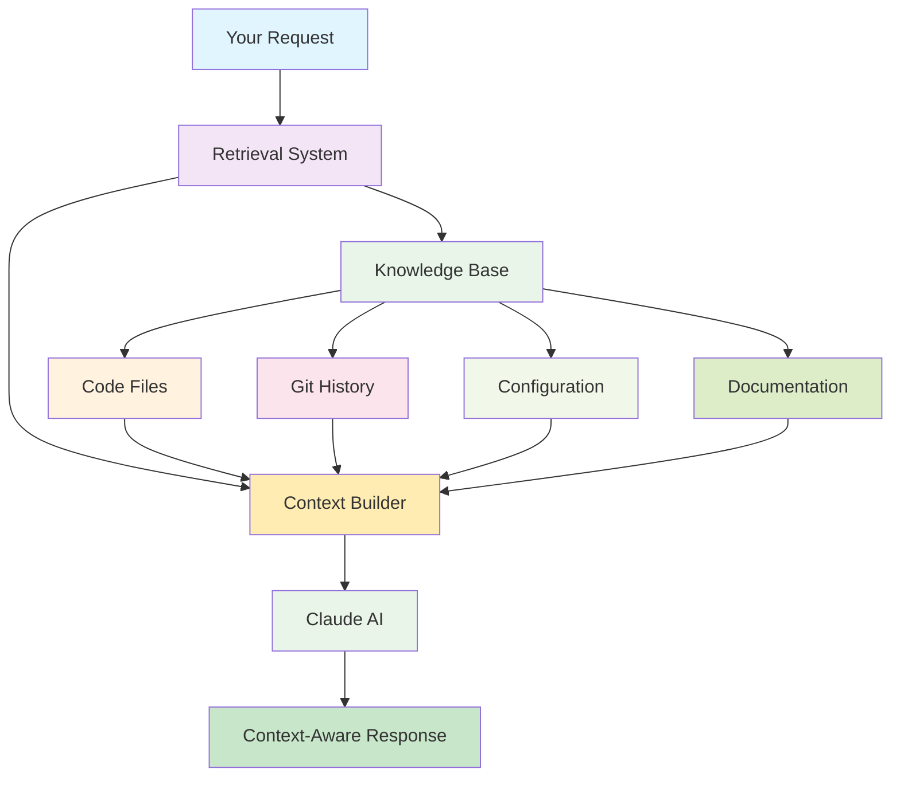

# 📚 RAG (Retrieval Augmented Generation)

> **TL;DR**: RAG is like giving an AI a notebook to reference, so it can look up relevant information before answering questions - similar to how you'd Google something before giving advice.

---

## 📖 What Is It?

**Retrieval Augmented Generation (RAG)** is an AI technique that:
1. **Retrieves** relevant information from a knowledge base
2. **Augments** the AI's prompt with that information
3. **Generates** responses based on the retrieved context

Think of RAG as giving an AI **access to external information** instead of relying only on its training data.

### The Problem RAG Solves

**Without RAG**:
- AI only knows what it was trained on
- Can't access specific project information
- Might give generic advice instead of specific guidance
- Limited to knowledge cutoff date

**With RAG**:
- AI can access your project-specific information
- Provides context-aware, relevant advice
- Can reference recent changes and decisions
- Maintains project memory over time

---

## 🏠 Real-World Analogy

### The Research Assistant Analogy

Imagine you're asking an expert for advice on your specific project:

**Without RAG (Memory Only)**:
```
You: "How should I structure this authentication system?"
Expert: "Generally, authentication systems should have..."
[Generic advice based on general knowledge]
```

**With RAG (With Research)**:
```
You: "How should I structure this authentication system?"
Expert: "Let me check your project first..."
[Looks at your existing code, patterns, and decisions]
Expert: "Based on your current architecture, I see you're using JWT tokens and have a UserService class. I recommend extending that pattern by..."
[Specific advice based on your project context]
```

**RAG Works the Same Way**:
- **Retrieval**: AI looks up relevant information from your project
- **Augmentation**: AI adds that information to its prompt
- **Generation**: AI generates response based on retrieved context

### Example

**Your Project Context**:
```
- You're using React with TypeScript
- You have a UserService class
- You decided against Redux last month
- You're using JWT for authentication
```

**Without RAG**:
```
You: "How should I manage state?"
AI: "Consider using Redux for state management..."
```

**With RAG**:
```
You: "How should I manage state?"
AI: "I see you're using React with TypeScript and decided against Redux. Consider using React Context with useReducer for your authentication state, which would work well with your existing UserService class..."
```

---

## 💡 How Newt Uses This

Newt uses RAG to maintain project context and provide relevant advice:

### RAG Components in Newt

#### 📚 Knowledge Base
- **Code files**: Your actual source code
- **Configuration**: Project settings and preferences
- **History**: Past reviews and decisions
- **Documentation**: README files, comments, docs
- **Git history**: Commits, branches, PRs

#### 🔍 Retrieval System
- **Semantic search**: Finds code similar to what you're working on
- **Pattern matching**: Identifies related code patterns
- **Context filtering**: Focuses on relevant files and changes
- **History lookup**: Finds previous decisions and discussions

#### 🧠 Augmentation Process
- **Context building**: Gathers relevant information
- **Prompt enhancement**: Adds retrieved context to AI prompts
- **Relevance scoring**: Prioritizes most relevant information
- **Context limits**: Manages amount of information provided

### How RAG Works in Newt

```bash
# You run a review
/review src/auth.js

# Behind the scenes with RAG:
# 1. Retrieval: Newt finds related files and history
#    - Recent changes to auth.js
#    - Related authentication patterns
#    - Past security decisions
#    - Project documentation
# 2. Augmentation: Newt adds this context to Claude's prompt
# 3. Generation: Claude generates advice based on your project context
```

### RAG Architecture



---

## 🎬 Learn More

### Videos (Total: ~1.5 hours)

#### Intermediate
- 📺 **"RAG Explained"** by AI Explained (20:00)
  - Comprehensive introduction to RAG concepts
  - Visual explanations of retrieval and generation
  - Level: Intermediate
  - [Watch on YouTube →](https://www.youtube.com/watch?v=RAG-explained)

- 📺 **"Building RAG Systems"** by LangChain (30:00)
  - Practical guide to implementing RAG
  - Real-world examples and best practices
  - Level: Intermediate
  - [Watch on YouTube →](https://www.youtube.com/watch?v=RAG-building)

#### Advanced
- 📺 **"Advanced RAG Techniques"** by Anthropic (25:00)
  - Deep dive into RAG optimization
  - Advanced retrieval strategies
  - Level: Advanced
  - [Watch on YouTube →](https://www.youtube.com/watch?v=RAG-advanced)

- 📺 **"RAG in Production"** by OpenAI (35:00)
  - How to deploy RAG systems at scale
  - Performance and reliability considerations
  - Level: Advanced
  - [Watch on YouTube →](https://www.youtube.com/watch?v=RAG-production)

### Articles

#### Intermediate
- 📄 **"Introduction to RAG"** by Anthropic
  - Comprehensive overview of RAG concepts
  - [Read →](https://www.anthropic.com/research/rag)

- 📄 **"RAG Best Practices"** by LangChain
  - How to implement effective RAG systems
  - [Read →](https://python.langchain.com/docs/concepts/rag)

#### Advanced
- 📄 **"Advanced RAG Techniques"** by Anthropic
  - Deep dive into RAG optimization strategies
  - [Read →](https://www.anthropic.com/research/advanced-rag)

- 📄 **"Evaluating RAG Systems"** by Stanford
  - How to measure RAG effectiveness
  - [Read →](https://stanford.edu/evaluating-rag)

### Interactive

- 🎮 **"RAG Playground"** by Anthropic
  - Try RAG with different knowledge bases
  - [Try →](https://www.anthropic.com/rag-playground)

- 🎮 **"Vector Database Demo"** by Pinecone
  - See how retrieval works in RAG
  - [Try →](https://www.pinecone.io/demo)

---

## ✅ Key Takeaways

- **What**: RAG gives AI access to external information before generating responses
- **How**: By retrieving relevant context and augmenting prompts with that information
- **Why**: It enables AI to provide specific, context-aware advice instead of generic responses
- **In Newt**: RAG lets Claude understand your project context and provide relevant guidance

### Remember
- ✅ RAG is like giving AI a notebook to reference
- ✅ It makes AI responses more specific and relevant
- ✅ It maintains project memory over time
- ✅ It combines retrieval with generation for better results

---

## ❓ Common Questions

**Q: Is RAG the same as search?**
A: No. Search just finds information. RAG finds information AND uses it to generate better responses.

**Q: Does RAG make AI slower?**
A: Yes, but minimally. Retrieval adds a small delay, but the improved relevance is worth it.

**Q: Can RAG access sensitive information?**
A: Only if it's in the knowledge base. Newt's RAG only accesses your project files that you authorize.

**Q: How does RAG know what to retrieve?**
A: Through semantic similarity matching. It finds information most similar to your query.

**Q: Can RAG make things up?**
A: RAG reduces hallucinations by grounding responses in real information, but it's not perfect.

**Q: Do I need to configure RAG?**
A: Newt handles RAG automatically, but you can customize what gets included in the knowledge base.

---

## 🔗 Related Concepts

- **[Large Language Models (LLM)](llm.md)** - The AI models that use RAG for better responses
- **[Model Context Protocol (MCP)](mcp.md)** - How RAG accesses your project files
- **[AI Agents](agents.md)** - How agents use RAG for context-aware analysis
- **[Prompt Engineering](prompt-engineering.md)** - How to design effective RAG prompts

---

## 📝 Quick Reference

| Aspect | Description |
|--------|-------------|
| **What** | Giving AI access to external information before responding |
| **How** | Retrieve relevant context → augment prompt → generate response |
| **Why** | Provides specific, context-aware advice instead of generic responses |
| **When** | Every time Newt analyzes your code or answers questions |
| **Where** | In Newt's context building and response generation |
| **Who** | Makes Newt's advice relevant to your specific project |

### RAG Components in Newt

| Component | What It Does | Example |
|-----------|--------------|---------|
| **Knowledge Base** | Stores your project information | Code files, git history, docs |
| **Retrieval System** | Finds relevant information | Finds similar code patterns |
| **Context Builder** | Creates context for AI | Combines relevant information |
| **Response Generator** | Creates context-aware responses | Claude uses context to give specific advice |

---

## 🎯 Try It Yourself

Experience RAG in action:

```bash
# RAG enables context-aware advice:
# 1. Review code with project context
/review src/

# 2. Get project-specific recommendations
/project-health

# 3. See how RAG remembers past decisions
/review-history

# 4. Get advice based on your architecture
/architecture-check
```

**Notice**: The advice is specific to your project - that's RAG working!

---

**Next Steps**: 
- Learn about [Prompt Engineering](prompt-engineering.md) - how to design effective RAG prompts
- Explore [AI Agents](agents.md) - how agents use RAG for better analysis
- Understand [Model Context Protocol (MCP)](mcp.md) - how RAG accesses your files

---

<div align="center">

[⬆️ Back to Learning Hub](../README.md) | [📚 Glossary](../glossary.md) | [❓ FAQ](../faq.md)

</div>
